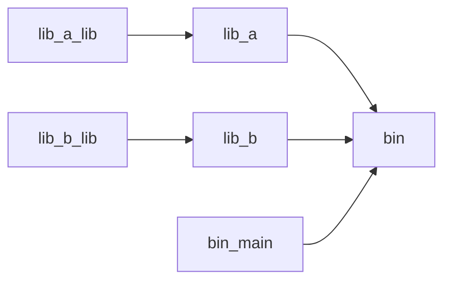

# Build system

*You are implementing a backend service in Rust which offers an API.  At some
point you realize that you need a frontend to configure it properly.
Helpfully, one of your colleagues implements a frontend for you in React.  You
notice that it would be convenient if the backend would serve the files of the
frontend, and you are looking for some way to tell Cargo to build and embed the
frontend files into the backend's binary.  How can you achieve this?*

With Cargo, Rust has some fanstastic tooling for building, cross-compiling
and testing Rust software. Cargo supports installing plugins that extend it's
functionality, a lot of which are discussed in this book. If your Rust
project has a relatively simple setup, where it consists only of Rust crates,
then Cargo is the ideal tool to get it to build:

Things start to get tricky when you involve other languages (such as mixing
Rust with C, C++, TypeScript) or when the build involves building code for
different targets (for example, that some crates need to be built as WebAssembly
and the resulting code is needed by other build.

### Example architectures

For example, some projects may need to interface with some legacy C/C++ code.
In this case, building might involve compiling the library first:

Another common pattern when building full-stack web applications with Rust
is that you might write the frontend in Rust and need to compile it to WebAssembly,
and the backend in Rust. You want the Rust backend to serve the frontend, so
it requires the WebAssembly output as a build input:

If you build a traditional web application with a TypeScript frontend and a
Rust backend, you may need to run a TypeScript compiler for some part of your
code and use the output as the input for your backend.

Other configurations are also possible, it depends on your particular need.

## Build Systems

Build systems are high-level tools to orchestrate the build process. They track
tasks and dependencies, and make sure that the build steps are run in the right
order and rerun when any of the inputs have changed. 

Good build systems will enforce [hygiene by sandboxing build steps][sandboxing]
to make sure you do not accidentally depend on inputs you have not declared.
This helps to avoid the "it works on my machine" syndrome, where your code
accidentally depends on some system state that is present on your machine but
not on other's.

However, build systems become interesting to your Rust project when one of
three things happen:

- Inside your project, you have **multi-language components**. For example, a frontend
  written in TypeScript, a backend component written in Kotlin, a C library,
  some Python tooling.
- Inside your project, you have **cross-target dependencies**. For example, you
  have a project fully written in Rust, and the backend wants to embed the
  frontend compiled to WebAssembly using a tool such as `trunk` for ease of
  deployment.
- You depend on some **external dependency** which is not written in Rust, and you
  want to be sure you can use reproducibly it on all platforms. For example,
  you depend on the presence of `sqlite` in a specific version.

Many build systems also offer fully reproducible builds by requiring all build
inputs and tools to be pinned down by hash, which enables distributed caching
which is a big quality of life improvement for developers as it leads to faster
development times.

This chapter discusses some build systems that play nice with Rust.  Note that
build systems are not necessarily mutually-exclusive: most of the time, even
when using a build system that is not Cargo, you will still have the necessary
Cargo manifests in the project that allows standard Cargo tooling to work.

## Reading

[The convergence of compilers, build systems and package managers](http://blog.ezyang.com/2015/12/the-convergence-of-compilers-build-systems-and-package-managers/) by Edward Z. Yang

*Edward explains how build systems, compilers and package managers seem to
converge. This is certainly the case for Rust, which has Cargo which acts as a
build system (`cargo build`) and package manager (`cargo install`). He explains
that this is not an isolated phenomenon, but inherent. It appears that we are
heading towards a more integrated approach.*

[Multi-language build system options](https://cxx.rs/building.html)

*TODO*

[Build systems a la
carte](https://www.microsoft.com/en-us/research/uploads/prod/2018/03/build-systems.pdf)

*Paper which explain build systems, and how they work. It takes popular build
systems apart and explains their properties. A useful paper for anyone trying
to achieve a deep understanding of what build systems are and how they work.*

[Merkle trees and build systems](https://lwn.net/Articles/821367/)

[Amazon's Build System](https://gist.github.com/terabyte/15a2d3d407285b8b5a0a7964dd6283b0) by Carl Meyers

*Carl explains the build system that Amazon uses.*

[Build System Schism: The Curse of Meta Build Systems](https://yzena.com/2024/03/build-system-schism-the-curse-of-meta-build-systems/) by Gavin D. Howard

*Gavin gives a summary of the evolution of build systems, into the modern ones
he calles meta build systems. He summarizes which features they have, and
argues that Turing-completeness is a property that is required for a good build
system.*

[cargo]: https://doc.rust-lang.org/cargo/
[sandboxing]: https://bazel.build/docs/sandboxing
