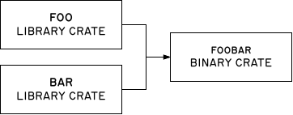
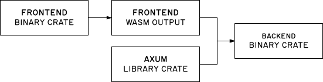
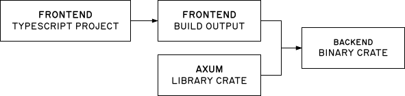

# Build system

Cargo is a great tool for building, cross-compiling and testing Rust software.
It supports installing plugins that extend its functionality, many of which are
discussed in this book. If your project consists only of Rust crates, then Cargo
is all you need:

<center>



</center>

Things start to get tricky when you involve other languages (such as mixing Rust
with C, C++, TypeScript) or when parts of your project need to be compiled for
different targets (for example, compiling some crates to WebAssembly and
embedding the output into other builds).

### Example architectures

For example, some projects may need to interface with some legacy C/C++ code. In
this case, building might involve compiling the library first:

<center>


</center>

Another common pattern when building full-stack web applications with Rust is
that you might write the frontend in Rust and need to compile it to WebAssembly,
and the backend in Rust. You want the Rust backend to serve the frontend, so it
requires the WebAssembly output as a build input:

<center>



</center>

If you build a traditional web application with a TypeScript frontend and a Rust
backend, you may need to run a TypeScript compiler for some part of your code
and use the output as the input for your backend.

<center>



</center>

Other configurations are also possible, it depends on your particular need.

## Build Systems

Build systems are high-level tools to orchestrate the build process. They track
tasks and dependencies, and make sure that the build steps are run in the right
order and rerun when any of the inputs have changed.

Good build systems will enforce [hygiene by sandboxing build steps][sandboxing]
to make sure you do not accidentally depend on inputs you have not declared.
This helps to avoid the "it works on my machine" syndrome, where your code
accidentally depends on some system state that is present on your machine but
not on others'.

However, build systems become interesting to your Rust project when one of three
things happen:

- Inside your project, you have **multi-language components**. For example, a
  frontend written in TypeScript, a backend component written in Kotlin, a C
  library, some Python tooling.
- Inside your project, you have **cross-target dependencies**. For example, you
  have a project fully written in Rust, and the backend wants to embed the
  frontend compiled to WebAssembly using a tool such as `trunk` for ease of
  deployment.
- You depend on some **external dependency** which is not written in Rust, and
  you want to be sure you can use it reproducibly on all platforms. For example,
  you depend on the presence of `sqlite` in a specific version.

Many build systems also offer fully reproducible builds by requiring all build
inputs and tools to be pinned down by hash, which enables distributed caching
which is a big quality of life improvement for developers as it leads to faster
development times.

This chapter discusses some build systems that play nice with Rust. Note that
build systems are not necessarily mutually-exclusive: most of the time, even
when using a build system that is not Cargo, you will still have the necessary
Cargo manifests in the project that allows standard Cargo tooling to work.

## Reading

```reading
style: article
title: The convergence of compilers, build systems and package managers
url: https://blog.ezyang.com/2015/12/the-convergence-of-compilers-build-systems-and-package-managers/
author: Edward Z. Yang
---
Edward explains how build systems, compilers and package managers seem to
converge. This is certainly the case for Rust, which has Cargo which acts as a
build system (`cargo build`) and package manager (`cargo install`). He explains
that this is not an isolated phenomenon, but inherent. It appears that we are
heading towards a more integrated approach.
```

```reading
style: book
title: Build Systems and Build Philosophy
url: https://abseil.io/resources/swe-book/html/ch18.html
author: Erik Kuefler
---
*This chapter in the book discusses why build systems are vital in scaling
software development, because they ensure that software can be built correctly
on a number of different systems and architectures.*
```

```reading
style: book
title: "Chapter 4: Multi-language build system options"
url: https://cxx.rs/building.html
author: cxx crate
---
The CXX crate's documentation discusses build system options for projects that
mix Rust and C++. It recommends Cargo for projects without an existing C++ build
system, Bazel for multi-language projects, and CMake for codebases already using
it.
```

```reading
style: article
title: Build systems à la carte
url: https://www.microsoft.com/en-us/research/uploads/prod/2018/03/build-systems.pdf
author: Andrey Mokhov, Neil Mitchell and Simon Peyton-Jones
---
Paper which explain build systems, and how they work. It takes popular build
systems apart and explains their properties. A useful paper for anyone trying
to achieve a deep understanding of what build systems are and how they work.
```

```reading
style: article
title: Merkle trees and build systems
url: https://lwn.net/Articles/821367/
author: David Röthlisberger
---
David explores using Merkle trees to track build outputs. By storing build
artifacts in OSTree (a content-addressable store where each directory's hash
is derived from its contents), any change to a file automatically propagates
up through the tree. The build system can then use a single root hash to
determine whether a rebuild is needed, enabling deduplication, automatic
incremental rebuilds, and passing intermediate outputs between build steps
without explicit naming.
```

```reading
style: article
title: Amazon's Build System
url: https://gist.github.com/terabyte/15a2d3d407285b8b5a0a7964dd6283b0
author: Carl Meyers
archived: terabyte-amazon-build-tool.pdf
---
Carl describes Brazil, Amazon's internal build system. Brazil enforces
reproducible builds through strict dependency isolation (only explicitly declared
dependencies are available), uses "version sets" to manage compatible collections
of package versions across hundreds of services, and separates interface versions
from concrete build versions. The article argues that these properties are
inevitable discoveries of any large engineering organization.
```

```reading
style: article
title: "Build System Schism: The Curse of Meta Build Systems"
url: https://yzena.com/2024/03/build-system-schism-the-curse-of-meta-build-systems/
author: Gavin D. Howard
archived: yzena-build-system-schism.pdf
---
Gavin gives a summary of the evolution of build systems, into the modern ones
he calls meta build systems. He summarizes which features they have, and
argues that Turing-completeness is a property that is required for a good build
system.
```

[cargo]: https://doc.rust-lang.org/cargo/
[sandboxing]: https://bazel.build/docs/sandboxing
