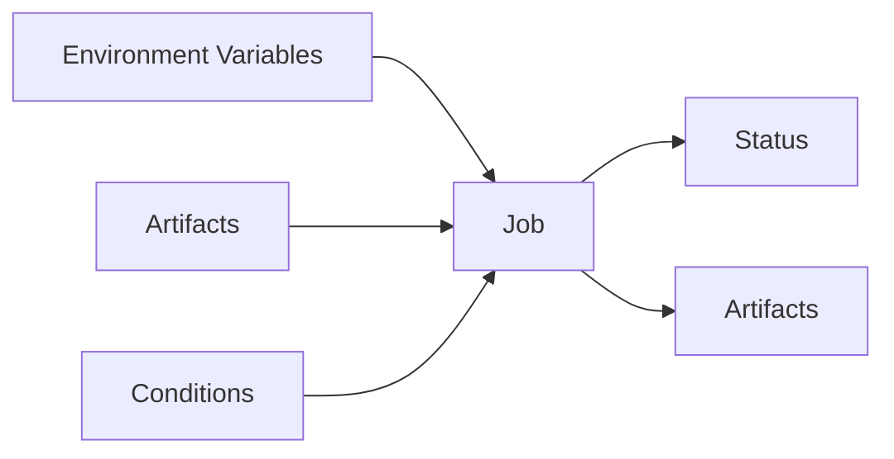

# GitLab CI

GitLab is an [open-source][source] software development platform. It is similar
to GitHub, but offers some more advanced features.

GitLab CI works by defining pipelines. These are triggered based on various
kinds of events, such as pushes to the repository, merges of code. Pipelines
can also be triggered manually or by a pipeline in another repository.

Pipelines consist of jobs, which run in sequence or in parallel. Jobs can have
outputs called *artefacts*, which can be downloaded from the web interface or
be ingested as inputs by jobs that follow.

[source]: https://gitlab.com/gitlab-org/gitlab

## Job Definition

- what is docker?

It is built around Docker containers, every job runs in a Docker container and
executes some commands that are configurable. Background services (such as
databases) can also be launched in the background by providing Docker images.

```yaml
test:cargo:
  image: "rust:latest"
  script:
    - rustc --version && cargo --version
    - cargo test --workspace --verbose
```

If you have ever used Docker, then you should easily be able to 



- docker containers
- inputs: environment variables, artifacts
- outputs: success, artifacts

### Environment Variables

### Artifacts

### Conditionals

### Services

If your job requires some services running, then you can define those. This is
often useful for running integration tests, where your projects requires a
database or a similar service running.

### Runners

The GitLab CI runner is configurable and can also uses other, non-Docker
backends, such as running jobs in virtual machines using QEMU (this is useful
for running tests on platforms such as FreeBSD or Windows).

## Pipeline Definition

### Stages

### Graph

## Features

### GitLab Pages

- publish anything statically
- useful for publishing documentation
- see documentation chapters for examples of this

## Examples

```yaml
test:cargo:
  image: "rust:latest"
  script:
    - rustc --version && cargo --version
    - cargo test --workspace --verbose
```

## Reading

[Get started with GitLab CI/CD](https://docs.gitlab.com/ee/ci/)

*Shows you how to get started with GitLab CI.*

[Deploying Rust with Docker and Kubernetes](https://www.fpcomplete.com/blog/deploying-rust-with-docker-and-kubernetes/)

*In this article, FP complete shows you how to deploy a Rust application with
Docker and Kubernetes using GitLab CI.*

[(New) Adventures in CI](https://www.bassi.io/articles/2019/04/13/adventures-in-ci/)

*In this blog post, Emmanuele Bassi shows you how the GNOME project uses GitLab
CI to generate coverage reports for every commit.*
