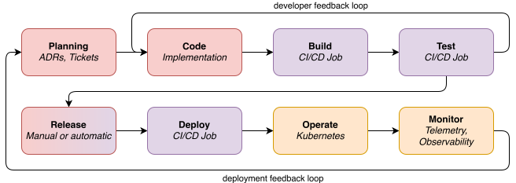

# Continuous Integration

Continuous Integration (CI) is a simple idea: run code automatically whenever
your code changes. When a developer opens a merge request, a machine somewhere
checks out the code, runs tests, checks formatting, runs lints, and reports back
whether everything passed. When the merge request is accepted, the same or
additional checks run again on the merged result.

The value of CI is that it removes reliance on individual developers remembering
to run every check before committing. A project with multiple contributors, each
with different local setups, cannot rely on hope as a correctness strategy. If
you care about a property of your codebase (that it compiles, that it passes
tests, that it has no spelling errors in its documentation) then you should
encode that property as an automated check and enforce it in CI. The saying
goes: If you liked it, then you should have put a test on it.

CI and Continuous Deployment (CD) are commonly talked about together. CD is
about automatically deploying code to production or staging environments after
it passes CI. We will not discuss CD.

<center>



</center>

All modern development platforms come with a CI system: GitHub has GitHub
Actions, GitLab has GitLab CI. There are also standalone CI systems like
Jenkins, Buildkite, and CircleCI. Unless you have specific requirements, use
whatever your development platform provides, it will be the best integrated and
the easiest to set up. Some CI systems have ways of feeding information from the
jobs back to developers. For example, after running the unit tests, changes in
which tests pass might be reported inline in a merge request, or changes in test
coverage might be shown.

The following subchapters cover [GitHub Actions](github.md) and
[GitLab CI](gitlab.md) specifically, but the concepts in this chapter apply to
any CI system, and many of the examples can be adapted to other systems easily.

## What to Run

The checks and tools covered throughout this book can be organized into two
tiers based on how frequently they should run. In an ideal world, you should be
able to run every check on every commit, but practically you want to strike a
balance between getting feedback quickly when merge requests are created, and
correctness. So a good tradeoff is to run the most important checks on every
merge request, and running more expensive checks on a schedule.

**Fast tier (every merge request).** These checks should be fast (under 10
minutes total) and run on every merge request. They catch the most common issues
and give contributors quick feedback:

- **[Formatting](../checks/formatting.md)**: `cargo fmt --check` verifies that
  code matches the project's style. This is the cheapest check and should run
  first.
- **[Lints](../checks/lints.md)**: `cargo clippy --all-targets -- -D warnings`
  catches common mistakes and non-idiomatic code.
- **[Typos](../checks/lints.md)**: `typos-cli` checks for spelling mistakes in
  code, comments, and documentation.
- **Tests**: `cargo test` (or `cargo nextest run` if you use
  [cargo-nextest](../testing/runners.md) for faster parallel execution).
- **Documentation**: `cargo doc --no-deps` ensures that documentation builds
  without errors. Broken doc links and malformed examples are caught here.

**Thorough tier (on merge or on schedule).** These checks are too slow or too
noisy for every merge request, but they catch important issues that the fast
tier misses:

- **[Dependency auditing](../checks/audit.md)**: `cargo audit` or
  `cargo deny check` flags known vulnerabilities. Running on a schedule catches
  new advisories published after a dependency was added.
- **[Semver checks](../checks/semver.md)**: `cargo semver-checks` verifies that
  your public API changes match your version bump.
- **[Feature powerset](../checks/features.md)**:
  `cargo hack check --feature-powerset` ensures that all feature flag
  combinations compile. This is combinatorially expensive and typically runs on
  merge to the main branch.
- **[MSRV verification](../checks/msrv.md)**: test against your declared minimum
  supported Rust version to make sure you have not accidentally used a newer
  API.
- **[Outdated dependencies](../checks/outdated.md)**: `cargo outdated` or
  `cargo upgrades` on a weekly schedule, so dependency drift does not pile up
  unnoticed.
- **[Fuzzing](../testing/fuzzing.md)**: even short fuzzing runs (a few minutes)
  on a schedule can catch bugs that deterministic tests miss.
- **[Mutation testing](../testing/mutations.md)**: `cargo mutants --in-diff` on
  merge to the main branch verifies that your test suite actually catches
  regressions.
- **[Test coverage](../measure/coverage.md)**: generate coverage reports and
  upload them to a service like Codecov or Coveralls.
- **[External service tests](../testing/external-services.md)**: integration
  tests that depend on databases or other services via Docker Compose or
  testcontainers are often too slow or too complex for every merge request.

### Linear History

CI systems typically test only the latest commit in a merge request. If the
merge request contains multiple commits and some of the intermediate commits are
broken, those broken commits end up on the main branch even though CI reported
success. This matters for workflows like `git bisect`, where you need every
commit on main to be in a working state.

There are two common solutions. The first is to configure your platform to
squash commits on merge, so that all the commits from a merge request are
collapsed into a single commit — and that single commit is the one that CI
tested. The second is to enforce a linear history by requiring that merge
requests are rebased onto the main branch before merging, with no merge commits
allowed.

For projects with high merge throughput, even rebasing is not enough: if two
merge requests both pass CI independently but conflict when merged together, the
second one can break main. Merge trains solve this by queuing up merge requests
and testing each one on top of the result of the previous. GitLab supports merge
trains natively. GitHub does not have a built-in equivalent, though Bors and
Mergify provide similar functionality.

## Publishing Artifacts

CI does not just produce pass/fail results. Many CI systems can also host static
content generated during a CI run. This is useful for publishing things like:

- **[API documentation](../documentation/rustdoc.md)** generated by `cargo doc`,
  allowing users to browse the public API of your crates without building docs
  locally. For crates published to crates.io, docs.rs does this automatically,
  but for internal crates or workspaces, hosting your own is the only option.
- **[Coverage reports](../measure/coverage.md)** generated by
  [`cargo-llvm-cov`](https://github.com/taiki-e/cargo-llvm-cov) in HTML format,
  giving developers a browsable view of which lines and functions still lack
  test coverage.
- **[Book documentation](../documentation/book.md)** generated by
  [`mdBook`](https://github.com/rust-lang/mdBook), providing public-facing
  guides and reference documentation that live alongside the code and are
  rebuilt automatically on every change.
- **Nightly binaries** built from the latest commit on the main branch, allowing
  testers and early adopters to try new features without waiting for an official
  release.

Both GitLab and GitHub offer a Pages feature for hosting static content directly
from CI. GitLab Pages is particularly straightforward: any job named `pages`
that produces a `public/` artifact will be deployed automatically. GitHub Pages
requires a bit more configuration through dedicated actions. The platform
subchapters cover the specifics.

## Releases

CI is a natural place to automate the release process. When you push a Git tag
(like `v1.0.0`), a CI pipeline can build release binaries for multiple
platforms, publish the crate to [crates.io](../releasing/crates.md), create a
release on your development platform with downloadable assets, generate a
[changelog](../releasing/changelog.md), and build
[packages](../releasing/packaging.md) for distribution (`.deb`, `.rpm`,
tarballs). The Releasing chapter covers the tools involved; the platform
subchapters show how to wire them into CI pipelines.

Both GitLab and GitHub also include a built-in Docker container registry,
allowing CI pipelines to build and publish
[container images](../releasing/docker.md) as part of the release process.

## Reproducibility

A CI pipeline has many inputs beyond your source code: the Rust toolchain
version, dependency versions, runner images, and auxiliary tool binaries. Any of
these can change between runs without your code changing, which means the same
commit can produce different results on different days.

Depending on your development style, this may or may not matter to you. If you
need to support old versions of your software, for example, you probably want to
make sure that CI on a year-old branch does not start failing because your code
no longer passes new Clippy lints or because a tool you install changed its
output format. If reproducibility is something you care about, you need to think
about pinning your environment as much as you can, from the Rust compiler
version to the tooling you use and the CI configuration you run.

### Pinning the Toolchain

The `rust-toolchain.toml` file, committed to the repository root, declares which
Rust toolchain the project uses:

```toml
[toolchain]
channel = "1.82.0"
components = ["rustfmt", "clippy"]
```

Both `rustup` and most CI toolchain installers respect this file automatically,
so the same toolchain version is used in CI and on every developer's machine.
This is more reliable than hardcoding the version in CI configuration, because
the CI config and the developer's local toolchain can drift apart. With
`rust-toolchain.toml`, there is a single source of truth.

### Pinning Dependencies

Cargo resolves dependency versions at build time unless told not to. If a
dependency publishes a new patch version between two CI runs, the second run may
compile different code than the first. The `--locked` flag prevents this:

```bash
cargo test --locked
```

With `--locked`, Cargo refuses to build if the `Cargo.lock` file does not match
the current dependency resolution. This ensures CI uses exactly the versions the
developer tested locally. It also catches a common mistake: updating a
dependency in `Cargo.toml` but forgetting to commit the updated `Cargo.lock`.

### Pinning Tool Versions

When installing Cargo subcommands, pin the version. An unpinned
`cargo install cargo-audit` will install whatever the latest release is at the
time the job runs, which can introduce new warnings or behavior changes that
have nothing to do with your code:

```bash
# Unpinned — may change between runs:
cargo install cargo-audit

# Pinned — deterministic:
cargo install cargo-audit@0.21.0
```

### Nix

For projects that already use [Nix](../build-system/nix.md), running CI inside a
Nix development shell pins the Rust toolchain, all system dependencies, and all
auxiliary tools to exact versions via the flake lockfile. This achieves all of
the above in one step. The tradeoff is adoption cost: Nix has a steep learning
curve, and adding it solely for CI reproducibility is rarely worth it. But for
projects that already have a `flake.nix`, using it in CI is a natural extension.
It also means developers can run the same checks locally and be confident that
the outcome matches CI. The platform subchapters cover how to set up Nix in
[GitHub Actions](github.md#nix-as-a-reproducibility-layer) and
[GitLab CI](gitlab.md#nix).

Each CI platform also has its own reproducibility concerns (action versions in
GitHub, Docker image tags in GitLab, runner images), which are covered in the
respective subchapters.

## Security

CI jobs often need access to secrets: registry tokens for publishing crates,
deployment credentials, API keys for external services. If your repository
accepts contributions from external developers, those developers' merge requests
will trigger CI runs. Depending on how your CI is configured, those runs may
have access to your secrets.

This is a real attack vector. An attacker can submit a merge request that
modifies CI configuration or test code to exfiltrate secrets to an external
server. The specifics of how to mitigate this differ by platform — protected
variables, environment scoping, restricted triggers — and are covered in the
[GitHub Actions](github.md) and [GitLab CI](gitlab.md) chapters. The important
thing is to be aware that CI pipelines are an attack surface and to think
carefully about which jobs need which secrets and who can trigger them.

## Reading

```reading
style: article
url: https://martinfowler.com/articles/continuousIntegration.html
title: Continuous Integration
author: Martin Fowler
---
In this article, Martin summarizes continuous integration practices. In his
own words:

*Continuous Integration is a software development practice where each
member of a team merges their changes into a codebase together with their
colleagues changes at least daily. Each of these integrations is verified by an
automated build (including test) to detect integration errors as quickly as
possible. Teams find that this approach reduces the risk of delivery delays,
reduces the effort of integration, and enables practices that foster a healthy
codebase for rapid enhancement with new features.*
```

```reading
style: article
url: https://abseil.io/resources/swe-book/html/ch23.html
title: Continuous Integration
author: Software Engineering at Google
---
A chapter on Google's approach to continuous integration. The chapter argues
that the cost of a bug grows the later it is caught, so CI should shift
detection as early as possible. To do this effectively, split your tests:
fast, hermetic tests run on every merge request, while slow or
non-deterministic tests run post-submit. The system only works if developers
trust it, which means investing in test reliability. Flaky or non-hermetic
tests erode that trust, and developers quickly learn to ignore CI results
that regularly fail for reasons unrelated to their changes. A case study
illustrates the impact: moving end-to-end tests from nightly to post-submit
within two hours cut the set of suspect changes per failure by 12x.
```
