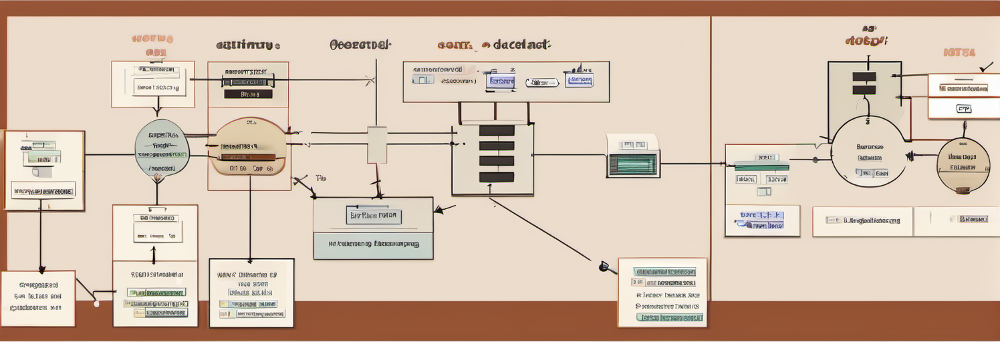

# Organization

In Rust, code organization is facilitated through a range of structures:
*files*, *modules*, *crates*, and *workspaces*. This chapter aims to provide
guidance on how to best utilize these elements to structure your Rust projects
effectively. The emphasis will be on achieving two key objectives: enhancing
development speed and promoting loose coupling for better code maintainability.

## Development Speed

Rust emphasizes a feature known as *zero-cost abstractions*. These are
programming abstractions that are beneficial for developers, offering utility
without incurring any runtime cost. This focus sets Rust apart from many other
programming languages, which offer similar abstractions but with a runtime
penalty. However, these zero-cost abstractions in Rust are not without their
own trade-off: they often lead to longer compile times[^proc].

This trade-off means Rust code is typically optimized for fast execution at the
expense of compile speed. Yet, faster compile times hold their own importance.
They are crucial in maintaining a tight iteration loop, allowing developers to
quickly make code changes, compile, and test. This rapid feedback loop is
essential for efficient feature development and debugging.

In this chapter, we'll delve into various choices that can be made while
setting up a Rust project to optimize compile times. We'll explore these
options and their implications, aiming to balance efficient development cycles
with optimal runtime performance.

## Loose Coupling

Nobody wants to work in a giant, monolithic application
that is tightly coupled and complex to change. Ideally, we want to make it as
easy as possible to produce code that is composed of small units which can be
tested individually.

---

[^proc]: For example, procedural macros allow for eliminating a lot of repeated
code, for example by automatically deriving traits on structures. However, they
need to be built and executed and thus add to the compilation time.

