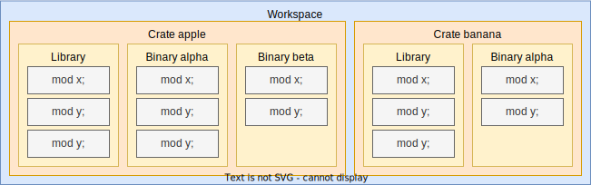

# Organization

In Rust, code organization is facilitated through a range of structures:
*files*, *modules*, *crates*, and *workspaces*. This chapter aims to provide
guidance on how to best utilize these elements to structure your Rust projects
effectively. The emphasis will be on achieving two key objectives: *enhancing
development speed* and *promoting loose coupling* for better code
maintainability.

<figure>

<caption>

*Example of a Rust project's organization, with a single workspace containing multiple
crates.*

</caption>
</figure>

Before we dive into this chapter, we should define what all of these terms mean.

| Name | Description |
| :---: | --- |
| **Module** | Modules in Rust are used to hierarchically split code into logical units. Modules have a path, for example `std::fs`. Modules contain functions, structs, traits, `impl` blocks, and other modules. |
| **File** | A single source file, typically with a `.rs` extension. Every file is a module, but files can also contain inline (nested) modules. |
| **Crate** | Compilation unit in Rust. Can be a *library crate* or a *binary crate*, the latter require the presence of a `main()` function. They have an entrypoint, which is typically `lib.rs` or `main.rs` but can also be called something else. |
| **Package** | Collection of crates. Every package may contain at most one library crate, and may contain multiple binary crates. |
| **Workspace** | A collection of packages, which can share a build cache, dependencies and metadata. |

In this chapter, we will briefly cover how you can use these to structure your
project.

## Development Speed

Rust emphasizes a feature known as *zero-cost abstractions*. These are
programming abstractions that are beneficial for developers, offering utility
without incurring any runtime cost. This focus sets Rust apart from many other
programming languages, which offer similar abstractions but with a runtime
penalty. However, these zero-cost abstractions in Rust are not without their
own trade-off: they often lead to longer compile times[^proc].

This trade-off means Rust code is typically optimized for fast execution at the
expense of compile speed. Yet, faster compile times hold their own importance.
They are crucial in maintaining a tight iteration loop, allowing developers to
quickly make code changes, compile, and test. This rapid feedback loop is
essential for efficient feature development and debugging.

In this chapter, we'll delve into various choices that can be made while
setting up a Rust project to optimize compile times. We'll explore these
options and their implications, aiming to balance efficient development cycles
with optimal runtime performance.

## Loose Coupling

To ensure a system remains maintainable, testable, and easily adaptable,
employing a strategy of loose coupling[^coupling] is often useful. Working
with a large, monolithic application that's tightly coupled can be challenging
and complex, making changes difficult. The ideal scenario involves creating
code composed of smaller, independent units that can be tested on an individual
basis. In this chapter, we'll explore how to achieve this level of modularity
and loose coupling in Rust, laying out strategies to build systems that are
both robust and flexible.

## Reading

~~~reading
style: book
title: "Chapter 7: Managing Growing Projects with Packages, Crates, and Modules"
url: https://doc.rust-lang.org/book/ch07-00-managing-growing-projects-with-packages-crates-and-modules.html
author: The Rust Programming Language
---
This chapter of The Rust Book shows you what facilities Rust has for
structuring projects. It introduces the concepts of packages, crates and
modules.
~~~

~~~reading
style: article
title: "Chapter 2.5: Project Layout"
url: https://doc.rust-lang.org/cargo/guide/project-layout.html
author: The Cargo Book
---
This section in The Cargo Book explains the basic layout of a Rust project.
~~~

~~~reading
style: article
title: "Rust at scale: packages, crates, modules"
url: https://mmapped.blog/posts/03-rust-packages-crates-modules
author: Roman Kashitsyn
archived: mmapped-rust-packages-crates-modules.pdf
---
Roman discusses how you can scale Rust projects, and what he has learned from
participating in several large Rust projects. He gives some guidance on when to
put things into modules versus into crates, and what implication this has on
compile times. He also gives some advice on programming patterns, such as
preferring run-time polymorphism over compile-time polymorphism. This article
is a must-read for anyone dealing with a growing Rust project and it encodes a
lot of wisdom that otherwise takes a long time to acquire.
~~~

~~~reading
style: article
title: Rust compile times
url: https://endler.dev/2020/rust-compile-times/
author: Matthias Endler
---
~~~

~~~reading
style: article
title: The Dark side of inlining and monomorphization
url: https://nickb.dev/blog/the-dark-side-of-inlining-and-monomorphization/
author: Nick Babcock
---
~~~

~~~reading
style: article
title: Delete Cargo Integration Tests
url: https://matklad.github.io/2021/02/27/delete-cargo-integration-tests.html
author: Alex Kladov
---
~~~

[^proc]: Procedural macros allow for eliminating a lot of repeated code, for
    example by automatically deriving traits on structures. However, they need
    to be built and executed and thus add to the compilation time.
[^coupling]: See [Loose Coupling](https://en.wikipedia.org/wiki/Loose_coupling) (Wikipedia).
