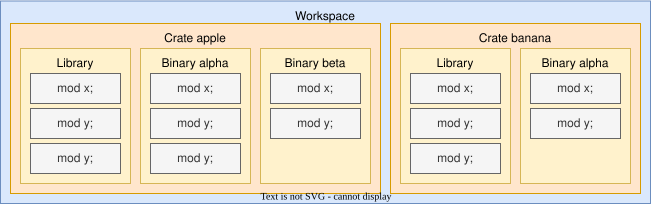

# Organization

Rust organizes code through _files_, _modules_, _crates_, and _workspaces_. How
you use these structures affects two things that matter as a project grows:
_development speed_ (how fast you can compile and iterate) and _loose coupling_
(how easily you can change one part without breaking another).

<figure>



<caption>

_Example of a Rust project's organization, with a single workspace containing
multiple crates._

</caption>
</figure>

Before we dive into this chapter, we should define what all of these terms mean.

|     Name      | Description                                                                                                                                                                                                                              |
| :-----------: | ---------------------------------------------------------------------------------------------------------------------------------------------------------------------------------------------------------------------------------------- |
|  **Module**   | Modules in Rust are used to hierarchically split code into logical units. Modules have a path, for example `std::fs`. Modules contain functions, structs, traits, `impl` blocks, and other modules.                                      |
|   **File**    | A single source file, typically with a `.rs` extension. Every file is a module, but files can also contain inline (nested) modules.                                                                                                      |
|   **Crate**   | Compilation unit in Rust. Can be a _library crate_ or a _binary crate_, the latter require the presence of a `main()` function. They have an entrypoint, which is typically `lib.rs` or `main.rs` but can also be called something else. |
|  **Package**  | Collection of crates. Every package may contain at most one library crate, and may contain multiple binary crates.                                                                                                                       |
| **Workspace** | A collection of packages, which can share a build cache, dependencies and metadata.                                                                                                                                                      |

In this chapter, we will briefly cover how you can use these to structure your
project.

## Development Speed

Rust's zero-cost abstractions produce fast binaries, but at the expense of
compile times[^proc]. This tradeoff means that how you organize your project
directly affects how fast you can iterate. A tight compile-test loop is
essential for productive development, and the organizational choices in this
chapter (splitting into crates, using workspaces, managing features) are the
main levers you have to keep compile times under control as a project grows.

## Loose Coupling

Large, monolithic codebases become difficult to change because everything
depends on everything else. Splitting code into smaller, independent units with
well-defined interfaces makes it easier to test components in isolation, assign
ownership to different teams, and change implementations without cascading
breakage. Rust's module and crate system provides natural boundaries for
achieving this[^coupling].

## Reading

```reading
style: book
title: "Chapter 7: Managing Growing Projects with Packages, Crates, and Modules"
url: https://doc.rust-lang.org/book/ch07-00-managing-growing-projects-with-packages-crates-and-modules.html
author: The Rust Programming Language
---
This chapter of The Rust Book shows you what facilities Rust has for
structuring projects. It introduces the concepts of packages, crates and
modules.
```

```reading
style: article
title: "Chapter 2.5: Project Layout"
url: https://doc.rust-lang.org/cargo/guide/project-layout.html
author: The Cargo Book
---
This section in The Cargo Book explains the basic layout of a Rust project.
```

```reading
style: article
title: "Rust at scale: packages, crates, modules"
url: https://mmapped.blog/posts/03-rust-packages-crates-modules
author: Roman Kashitsyn
archived: mmapped-rust-packages-crates-modules.pdf
---
Roman discusses how you can scale Rust projects, and what he has learned from
participating in several large Rust projects. He gives some guidance on when to
put things into modules versus into crates, and what implication this has on
compile times. He also gives some advice on programming patterns, such as
preferring run-time polymorphism over compile-time polymorphism. This article
is a must-read for anyone dealing with a growing Rust project and it encodes a
lot of wisdom that otherwise takes a long time to acquire.
```

```reading
style: article
title: Rust compile times
url: https://endler.dev/2020/rust-compile-times/
author: Matthias Endler
---
Matthias covers a wide range of strategies for reducing Rust compile times,
from updating your toolchain and removing unused dependencies to splitting
crates, using faster linkers, and optimizing CI with caching and cargo-nextest.
```

```reading
style: article
title: The Dark side of inlining and monomorphization
url: https://nickb.dev/blog/the-dark-side-of-inlining-and-monomorphization/
author: Nick Babcock
---
Nick explores how aggressive inlining and monomorphization can unexpectedly
bloat compiled artifacts. He demonstrates how a single `#[inline(always)]`
annotation on a large function caused massive code duplication across generic
instantiations, and shows how trait objects and removing inline hints reduced
binary size with negligible performance impact.
```

```reading
style: article
title: Delete Cargo Integration Tests
url: https://matklad.github.io/2021/02/27/delete-cargo-integration-tests.html
author: Alex Kladov
---
Alex argues for consolidating multiple integration test files into a single
test crate. Each integration test file compiles into a separate binary that
must be linked independently, and Cargo runs test binaries sequentially. When
the Cargo project itself consolidated its integration tests, compile time
dropped 3x and on-disk artifacts shrank 5x.
```

[^proc]:
    Procedural macros allow for eliminating a lot of repeated code, for example
    by automatically deriving traits on structures. However, they need to be
    built and executed and thus add to the compilation time.

[^coupling]:
    See [Loose Coupling](https://en.wikipedia.org/wiki/Loose_coupling)
    (Wikipedia).
