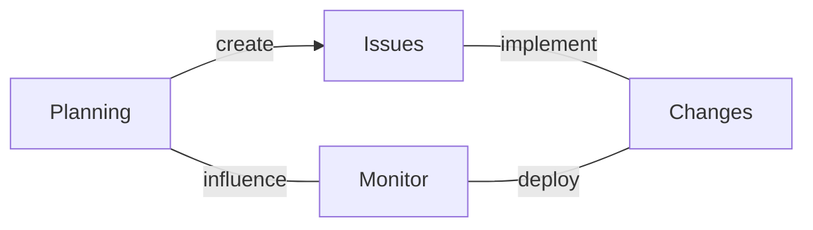
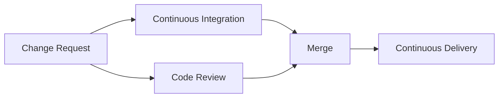

# Platform

Code is rarely written in isolation. Instead, it is a collaborative effort,
often taking place in public. Development platforms like [GitHub][github] or
[GitLab][gitlab] facilitate this collaboration, providing a space where
developers can come together. These platforms are built around version control
systems, which are essential for tracking changes and reverting to previous
versions when needed. They offer user-friendly interfaces that enable
developers to propose changes, submit pull requests, and conduct thorough code
reviews. Additionally, these platforms typically include project management
tools. For instance, a developer can track a bug as an *issue* and link it
directly to the *milestone* of the next software release, ensuring organized
and efficient project progression.

<figure>

<caption>

*High-level process overview of using modern software project platforms.*

</caption>
</figure>

In modern software development, efficiency is significantly enhanced by
outsourcing certain tasks to machines. Most development platforms today include
some kind of Continuous Integration[^ci] (CI) system. CI systems automatically run
tests and checks on new code submissions, ensuring they meet quality standards
before being approved for merging into the main codebase. Similarly, Continuous
Deployment (CD) systems automate tasks after the code is merged. For example,
they might deploy the updated code to staging or production environments. These
systems not only save time but also enhance the reliability and stability of
software products. For instance, when a developer commits code, the CI system
runs tests to verify that the new code is error-free, while the CD system can
automatically update a live application with these latest changes.

<figure>

<caption>

*Code review process in modern software project platforms.*

</caption>
</figure>

A primary focus of this book is exploring how aspects of a Rust software
project can be efficiently automated using Continuous Integration (CI) jobs.
Due to the nature of CI systems, the strategies and advice provided here are
specific to the chosen CI system. For the purposes of this book, we recommend
using GitHub and GitLab. These platforms have been chosen not only for their
wide adoption but also for their robust CI capabilities. Both are built on the
popular git version-control system, which is a cornerstone for modern code
management and collaboration. Their CI offerings stand out for their
flexibility, ease of integration, and comprehensive feature set with a free
tier that works well for open-source projects.

| Platform | Description |
| --- | --- |
|  | **GitLab**, with GitLab CI |
|  | **GitHub**, with GitHub Actions |

While this guide primarily focuses on these two CI systems, the core principles
and techniques can be readily adapted to other environments. I encourage you to
adapt the examples and techniques presented here to fit the platform or CI
system you are using. Although adapting these examples may require some
additional effort, the underlying concepts remain largely the same and should
be transferable.

[^ci]: [Continuous Integration](https://en.wikipedia.org/wiki/Continuous_integration) (Wikipedia)

## Reading

[github]: https://github.com
[gitlab]: https://gitlab.com

[Continuous Integration](https://martinfowler.com/articles/continuousIntegration.html) by Martin Fowler

> Continuous Integration is a software development practice where each member
> of a team merges their changes into a codebase together with their colleagues
> changes at least daily. Each of these integrations is verified by an
> automated build (including test) to detect integration errors as quickly as
> possible. Teams find that this approach reduces the risk of delivery delays,
> reduces the effort of integration, and enables practices that foster a
> healthy codebase for rapid enhancement with new features.

*In this article, Martin summarizes continuous integration practises.*
