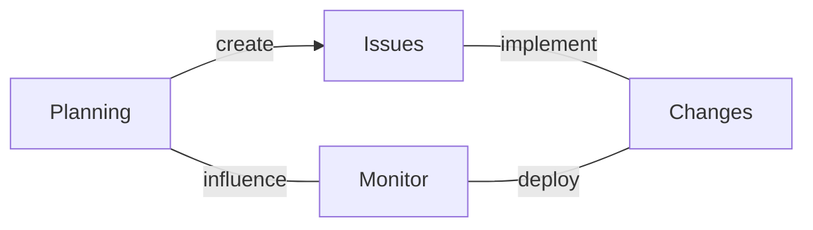
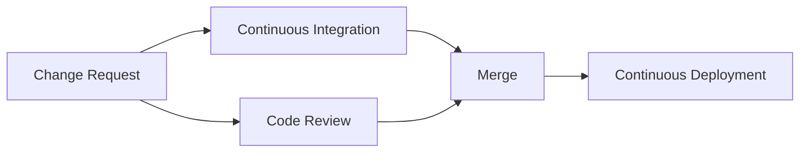

# Platform

Modern software development usually uses the [Git][git] version control system.
Typically, it is written using [*agile development* workflows][agile], where
the development process is focussed on [kanban boards][kanban] or [issue
trackers][issues], which are frequently updated in an [iterative
process][iterative]. 

[git]: https://en.wikipedia.org/wiki/Git
[agile]: https://en.wikipedia.org/wiki/Agile_software_development
[kanban]: https://en.wikipedia.org/wiki/Kanban_board
[issues]: https://en.wikipedia.org/wiki/Issue_tracking_system
[iterative]: https://en.wikipedia.org/wiki/Iterative_and_incremental_development

<figure>

<caption>

*High-level process overview of using modern software project platforms.*

</caption>
</figure>

Code changes are usually performed through [merge requests][merge], in which
developers propose code changes which implement features or fix bugs. Merge
requests are reviewed in [code review][code-review] by their peers and merged
into a [master branch][master]. Every code change is automatically tested by [continuous
integration][ci], and frequently deployed to staging or production environments
using [continuous deployment][cd].

[merge]: https://git-scm.com/book/en/v2/Git-Branching-Basic-Branching-and-Merging
[code-review]: https://en.wikipedia.org/wiki/Code_review
[master]: https://git-scm.com/book/en/v2/Git-Branching-Branches-in-a-Nutshell
[ci]: https://en.wikipedia.org/wiki/Continuous_integration
[cd]: https://en.wikipedia.org/wiki/Continuous_deployment

<figure>

<caption>

*Code review process in modern software project platforms.*

</caption>
</figure>

All of these processes are usually facilitated by a platform on which
development happens. These platforms host Git repositories, perform
access control, have issue trackers, user interfaces for merge requests
and code review. They also have continuous integration and continuous
deployment functionality.

This guide does not concern itself with the features of such platforms, however
much of the advice given in this guide revolves around automatically ensuring
quality of projects, which makes use of the continuous integration facilities
of these platforms.

In this guide, I will be focussing on how you can leverage the GitLab and
GitHub platforms and make use of their continuous integration facilities,
however you should be able to apply these easily to other platforms as well.

## Reading

[Continuous Integration](https://martinfowler.com/articles/continuousIntegration.html) by Martin Fowler

*In this article, Martin summarizes continuous integration practises. In his
own words: "Continuous Integration is a software development practice where each
member of a team merges their changes into a codebase together with their
colleagues changes at least daily. Each of these integrations is verified by an
automated build (including test) to detect integration errors as quickly as
possible. Teams find that this approach reduces the risk of delivery delays,
reduces the effort of integration, and enables practices that foster a healthy
codebase for rapid enhancement with new features."*

[Continuous Integration](https://abseil.io/resources/swe-book/html/ch23.html) in Software Engineering at Google

*TODO*
