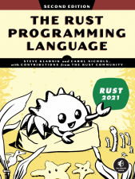
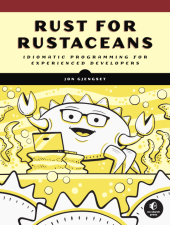
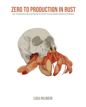
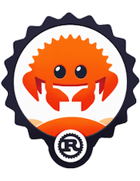

# Reading

This guide is aimed at developers and project managers already comfortable with
the Rust programming language. It does not cover any fundamentals of the
language itself, only how to structure projects.

If you feel that you need to refresh your Rust basics, I recommend you to read
or work through some of these resources. You do not need to work through all of
them, the guide merely assumes some foundational knowledge.

## Books

Below is a list of essential readings for grasping the intricacies of Rust.
Throughout this guide, where relevant, I will provide links to specific
chapters from these books. This will enable you to explore topics more
thoroughly and deepen your understanding as needed.

| Cover | Description |
| --- | --- |
| | **Rust Programming Language, 2nd Edition** by *Steve Klabnik and Carol Nichols* Available from [No Starch Press](https://nostarch.com/rust-programming-language-2nd-edition) and [online][rust-book].  The official guide to Rust. |
|  | **Rust for Rustaceans** by *Jon Gjengset* Available from [No Starch Press](https://nostarch.com/rust-rustaceans).  A deep dive into the Rust programming language. |
| | **Rust Design Patterns** by *Multiple Authors* Available [online](https://rust-unofficial.github.io/patterns/)  A catalogue of Rust design patterns, anti-patterns and idioms. |

## Interactive

Some people, including myself, enjoy learning new things through interactive
exploration. These resources teach Rust concepts primarily in such a way.

| Cover | Description |
| --- | --- |
|  | **Zero to Production** by *Luca Palmieri* Available [online](https://www.zero2prod.com/).  An introduction to backend development in Rust. |
|  | **Rust Adventure** by *Chris Biscardi* Available [online](https://www.rustadventure.dev/).  A collection of interactive courses that teaches you how to build things in Rust through a set of workshops. |
| | **CodeCrafters** Available [online](https://codecrafters.io/).  While not specific to Rust, CodeCrafters has a growing number of courses that are all built around the idea of reimplementing popular software yourself. Some of the courses they have are *Build your own Git*, *Build your own Redis*, and *Build your own SQLite*, to name but a few. What makes the courses fun is that they are broken down into small steps and come with unit tests that allow you to test your implementation as your progress. |

## Articles

Some people in the Rust community have written articles and guides with a
similar scope as this book. While some of the takes may be different from those
presented in this book, it can be valuable to review these to see which
conclusions others in the Rust community have arrived at.

[Writing Software that's reliable enough for
production](https://www.sciagraph.com/docs/understanding/reliable/) by
[Sciagraph](https://www.sciagraph.com/)

*Sciagraph is a profiler for Python data processing pipelines. In this blog
post, they explain how they approach writing software that is reliable, with
some very similar approaches as this guide recommends.*

[One Hundred Thousand Lines of
Rust](https://matklad.github.io/2021/09/05/Rust100k.html) by [Alex
Kladov](https://matkld.github.io)

*Alex Kladov is the driving force behind several high-profile projects in the
Rust community, such as
[rust-analyzer](https://github.com/rust-lang/rust-analyzer). In this article,
he explains lessons he has learned from maintaining several medium-sized Rust
projects.*

[Basic Things](https://matklad.github.io/2024/03/22/basic-things.html) by Alex Kladov

*Alex argues for some basic properties of software projects. He discusses how
getting these right can be a force-multiplier as projects grow in scope,
developers and users.*

[My Ideal Rust
Workflow](https://fasterthanli.me/articles/my-ideal-rust-workflow#building-checking-testing-linting)
by [fasterthanlime](https://fasterthanli.me/)

[Chapter 5: Continuous Deployment for Rust
Applications](https://www.lpalmieri.com/posts/2020-11-01-zero-to-production-5-how-to-deploy-a-rust-application/)
in [Zero to Production](https://zero2prod.com)

[Good Practises for Writing Rust
Libraries](https://pascalhertleif.de/artikel/good-practices-for-writing-rust-libraries/)
by [pascalhertleif](https://pascalhertleif.de/) (*published in 2015*)

[Issue #5656: Expand "CI Best Practises" section in the
guide](https://github.com/rust-lang/cargo/issues/5656) in
[rustlang/cargo](https://github.com/rust-lang/cargo)

## Videos

[Setting up CI and property testing for a Rust
crate](https://www.youtube.com/watch?v=xUH-4y92jPg) by Jon Gjengset

*In this video, Jon shows how to set up a CI pipeline and property testing for
a crate he has authored. This primer explains a lot of the things he does here
and why he does them. This stream is worth watching if you are interested in
watching the process of getting useful testing setup for a project.*

[zero-to-production]: https://www.zero2prod.com/
[rust-design-patterns]: https://rust-unofficial.github.io/patterns/
[effective-rust]: https://www.lurklurk.org/effective-rust/
[rustonimicon]: https://doc.rust-lang.org/nightly/nomicon/
[rust-book]: https://doc.rust-lang.org/book/
[rust-book-nostarch]: https://nostarch.com/rust-programming-language-2nd-edition
[rust-book-image]: https://nostarch.com/sites/default/files/styles/uc_product/public/RustProgramming2ndEd_comp.png
[rust-for-rustaceans]: https://nostarch.com/rust-rustaceans
[rust-for-rustaceans-image]: https://nostarch.com/sites/default/files/styles/uc_product/public/RustforRustaceans_cover.png
