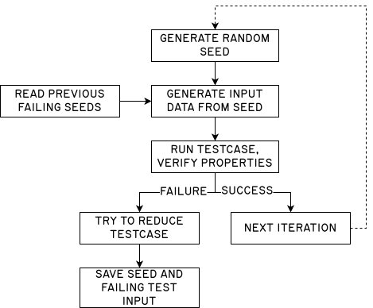
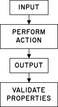

# Property Testing

Property testing is a testing methodology that allows you to generalize your
unit tests by running them with randomized inputs and testing _properties_ of
the resulting state, rather than coming up with individual test cases. This
gives you confidence that your code is _generally_ correct, rather than just
correct for the specific inputs you are testing. It is often effective at
finding edge cases you haven't considered.

<center>



</center>

What property-testing frameworks typically do is:

- **Generate** arbitrary (random) test-cases for your tests, with constraints
  that you specify. Typically, this works by generating a random seed, and using
  that in combination with a [pseudorandom number generator][prng] to randomly
  generate data structures that are used as input.
- **Simplify** failing inputs to create a small failing test-case, also called
  _test case shrinking_. This attempts to reduce the input test case to
  something smaller to eliminate parts of the input data that don't matter, and
  to make it easier to reproduce and track down the bug.
- **Record** failing test-cases, so you can replay them. Usually this works by
  recording the initial seed, so that the same input can be generated again.
- **Replay**: When running tests, recorded failing seeds are replayed first
  (before generating more randomized inputs) to ensure that there are no
  regressions where previously-found bugs resurface.

[prng]: https://en.wikipedia.org/wiki/Pseudorandom_number_generator

```admonish note
There is some overlap between property testing and [fuzzing](./fuzzing.md).
Both are testing strategies that rely on randomly generating input cases.
Usually, the difference is that property testing focuses on testing a single
component, whereas fuzzing tries to test a whole program. Additionally, fuzzing
usually employs instrumentation, where it monitors at runtime which branches
are taken and attempts to achieve full coverage. You can replicate
some of that by measuring [Test Coverage](../measure/coverage.md).

Usually, property tests run fast and can be part of your regular unit tests,
while fuzzing tests are run for hours and are not part of your regular testing
routine.
```

## Overview

### General Principle

When you write unit tests, you know the inputs and expected outputs. When you
use property testing, your inputs will be randomized, so you don't know ahead of
time what they will be. What you do here is that you test _properties_ of the
output state.

In general, all property tests are structured the same way: it is a test
function that is provided with some randomized inputs of a predefined shape,
runs some _action_ on the input, and then verifies the output.

<center>



</center>

If you are testing a stateful system, then the initial state of the system will
be the input, and the resulting state will be the output.

For example: if you have an API, and you are testing the _crate user_
functionality, then your initial API (and database) state will be the input.
Then you will run the action (create user). The property that you will test for
in the output state will be that the user exists.

### Testing Against a Reference

Rather than manually testing properties, you can also write property tests to
apply some operations onto both your implementation and a reference
implementation. For example, if you are implementing a specific data structure,
you can test it against another data structure (that might not be as optimized
as yours, but you know is correct).

### Action Strategy

One common pattern when doing property testing is letting the property testing
framework come up with a sequence of actions, and performing those. This
approach lets you test more complex interactions.

The way this works is that you create an enum that holds possible actions. These
actions can be anything, for example if you are testing a data structure you
might mimic the public interface of the data structure. If you are testing a
REST API, this struct would mimic the API endpoints that you want to test.

```rust
pub enum Action {
    CreateUser(Uuid),
    DeleteUser(Uuid),
}
```

You allow the property testing framework to generate a list of these actions,
and then you run them.

```rust
fn test_interaction(actions: Vec<Action>) {
    let service = Service::new();
    for action in actions {
        match action {
            Action::CreateUser(uuid) => {
                service.user_create(uuid);
                assert!(service.user_exists(uuid));
            },
            Action::DeleteUser(uuid) => {
                service.user_delete(uuid);
                assert!(!service.user_exists(uuid));
            },
        }
    }
}
```

You can extend this pattern by adding a proxy object that tracks expected state
alongside the real system. After each action, you assert that the real system's
state matches the proxy's. This is essentially the "testing against a reference"
approach from above, but applied to state transitions rather than pure
functions.

### Frameworks

There are three main property-testing ecosystems in Rust: `proptest`,
`quickcheck`, and `arbtest`. They all follow the generate-shrink-record-replay
pattern described above but differ in API design, shrinking strategy, and how
test inputs are defined.

## `proptest`

[`proptest`](https://docs.rs/proptest/latest/proptest/) is the most widely used
property-testing framework in Rust. It uses composable _strategies_ to define
how inputs are generated, and it has a powerful shrinking algorithm that reduces
failing inputs to minimal examples. Failing seeds are recorded so they are
replayed on future runs.

### Example

Imagine that you are trying to implement a novel sorting algorithm. You've read
the paper, and you've tried your best to follow along and implement it in Rust.
You came up with this implementation:

```rust
{{#include ../../examples/property-testing/src/lib.rs:sort_broken}}
```

Now, you want to test it. You can start by writing some simple unit tests for
it, or maybe you already have as you were implementing your algorithm because
you used _test-driven development_.

```rust
{{#include ../../examples/property-testing/src/lib.rs:unit_test}}
```

Running these works:

```
{{#include ../../examples/property-testing/output/unit_tests.txt}}
```

The issue now is that these working unit tests do not prove that your algorithm
works in general. All they do is prove that your algorithm works for these
specific inputs. What if there is a bug in your algorithm that is only triggered
on an edge case? Hint: there is, and we will find it.

We can use property testing to test the algorithm for randomized inputs. While
with unit testing, we test specific inputs and outputs, with property testing we
run our algorithm on unknown (random) inputs, and verify that certain properties
hold.

In this case, the function is supposed to sort an array of numbers. Sorting
implies two properties:

- The output should be sorted. This means that for any pair of adjacent numbers,
  the first should be lower or equal than the second.
- The output should contain the same numbers as the input (but maybe in a
  different order).

From this, we can derive some property checking functions. For each of our two
properties (that the output is sorted, and that the output should contain the
same elements), we write a proptest. Notice how this works: a proptest is just a
Rust unit test that takes a `Vec<u16>`. Proptest takes care of generating this
for us. Also, we use `prop_assert!()`, this is not required but makes the
proptest framework play nicer.

```rust
{{#include ../../examples/property-testing/tests/tests.rs}}
```

When you run this, you will see that it finds a failure. Because of a bug in the
implementation of our sorting algorithm, it does not work for all inputs.

```
{{#include ../../examples/property-testing/output/proptest_fail.txt:0:18}}
...
{{#include ../../examples/property-testing/output/proptest_fail.txt:297:}}
```

Helpfully, proptest records this failure. Typically, it will save the failing
seeds into a file adjacent to the source file that contains the test. In our
case, it saves them into `tests/tests.proptest-regressions`.

```
{{#include ../../examples/property-testing/output/proptest-regressions.txt}}
```

Can we fix this? For sure. Looking at the test, we can deduce what the issue is.
The problem seems to be that we remove all values from the input array, but we
only add it to the output once. So when the input array contains duplicate
values, the output will only contain a single one. We can fix this in the code
by counting the occurrences, and adding that many to the output:

```rust
{{#include ../../examples/property-testing/src/lib.rs:sort_fixed}}
```

Finally, we can run the property test again to verify that it works now.

```
{{#include ../../examples/property-testing/output/proptest_ok.txt}}
```

This example was maybe a bit simplistic, unit testing could have also caught
this issue. But it shows the general principle of doing property testing: you
identify general properties that your application should uphold after certain
actions. It works well for stateless code that has an input and an output, like
this. But you can also use it to test state transitions, as described in the
Action Strategy section above.

```admonish warning
Property testing is not guaranteed to find an issue, because it is randomized.
There are some things you can do to increase the chances that proptest can find
issues. For example, you can tweak how many iterations it performs.  You can
also reduce the search space, for example by operating on `Vec<u8>` instead of
`Vec<u64>`.

But if proptest does catch an issue, it makes it easy to reproduce it, debug it
and ensure that it does not occur again (regression).
```

### `test-strategy`

The [`test-strategy`](https://docs.rs/test-strategy/latest/test_strategy/) crate
is a companion to proptest that provides three features:

- An attribute macro (`#[proptest]`) that lets you write property tests as
  regular functions instead of using proptest's `proptest!` macro.
- Support for async property tests (with `tokio` and `async-std` executors).
- A derive macro for `Arbitrary` that makes it easy to generate custom types.

For example, writing a property test with `proptest` and the `test-strategy`
crate looks like this:

```rust
use test_strategy::proptest;

// regular test
#[proptest]
fn test_parser(input: String) {
    let _ = parse(&input);
}

// async proptest (uses tokio executor)
#[proptest(async = "tokio")]
async fn test_async_parser(input: String) {
    let _ = parse(&input).await;
}
```

The advantage in using `test-strategy` is the pleasant syntax, and the fact that
it handles async code easily.

The derive macro for `Arbitrary` makes it easy to generate random test inputs
for your custom structs.

```rust
use test_strategy::{proptest, Arbitrary};

#[derive(Arbitrary)]
pub struct User {
    name: String,
    age: u16,
}

#[proptest]
fn test_user(user: User) {
    // ...
}
```

## `quickcheck`

[`quickcheck`](https://github.com/BurntSushi/quickcheck) is the other
established property-testing crate in Rust, named after the original Haskell
[QuickCheck](https://hackage.haskell.org/package/QuickCheck) package. It
predates proptest and has a simpler API: you implement the `Arbitrary` trait for
your types and write test functions that return `bool`. QuickCheck handles
shrinking automatically.

The main difference from proptest is in how inputs are generated. Proptest uses
composable strategies that are separate from the types being tested, while
quickcheck ties generation to the type itself through `Arbitrary`. This makes
proptest more flexible for complex input shapes, but quickcheck simpler for
straightforward cases.

## `arbtest`

[`arbtest`](https://github.com/matklad/arbtest) is a minimalist property-testing
library that builds on the
[`arbitrary`](https://docs.rs/arbitrary/latest/arbitrary/) crate. Where proptest
has its own strategy system and quickcheck has its own `Arbitrary` trait,
`arbtest` reuses the `Arbitrary` trait from the `arbitrary` crate — the same
trait used by fuzzing tools like `cargo-fuzz`. This means types you've already
made fuzzable are immediately usable in property tests, and vice versa.

The API is intentionally tiny:

```rust
use arbtest::arbtest;

arbtest(|u| {
    let input: Vec<u8> = u.arbitrary()?;
    let sorted = sort(&input);
    assert!(sorted.windows(2).all(|w| w[0] <= w[1]));
    Ok(())
});
```

<!-- TODO: research arbtest more deeply — shrinking behavior, comparison with
     proptest strategies, real-world usage examples. Collect articles. -->

## Reading

```reading
style: book
title: Proptest Book
url: https://proptest-rs.github.io/proptest/
author: Proptest Project
---
The official book of the proptest crate. This is a valuable read if you want
to understand how it works and how you can customize it, for example by
implementing custom strategies for generating test inputs.
```

```reading
style: article
title: "Complete Guide to Testing Code in Rust: Property testing"
url: https://zerotomastery.io/blog/complete-guide-to-testing-code-in-rust/#Property-testing
author: Jayson Lennon
---
Jayson gives an overview of property testing in Rust as part of a broader
testing guide, covering how to use the proptest crate to generate randomized
inputs and test properties of your code.
```

```reading
style: article
title: Property-testing async code in Rust to build reliable distributed systems
url: https://www.youtube.com/watch?v=ms8zKpS_dZE
author: Antonio Scandurra
---
In this presentation, Antonio explains how he used property testing to test
the Zed editor for correctness. Being a concurrent, futures-based application,
it is important that the code is correct. By testing random permutations of the
futures execution ordering, he was able to find bugs in edge cases that would
otherwise have been very difficult to discover or reproduce.
```

```reading
style: article
title: An Introduction to Property-Based Testing in Rust
url: https://www.lpalmieri.com/posts/an-introduction-to-property-based-testing-in-rust/
author: Luca Palmieri
archived: lpalmieri-an-introduction-to-property-based-testing-in-rust.pdf
---
An excerpt from his book, *Zero to Production in Rust*, Luca does a deep-dive
into property testing in Rust. He shows how to test a web backend using its
REST API using both the `proptest` crate and the `quickcheck` crate.
```

```reading
style: article
title: Property-Based Testing in Rust with Arbitrary
url: https://www.greyblake.com/blog/property-based-testing-in-rust-with-arbitrary/
author: Serhii Potapov
archived: greyblake-property-based-testing-in-rust-with-arbitrary.pdf
---
Serhii shows how to use the `arbitrary` crate and the `arbtest` crate to
implement property-testing in Rust.
```

```reading
style: article
title: Bridging fuzzing and property testing
url: https://blog.yoshuawuyts.com/bridging-fuzzing-and-property-testing/
author: Yoshua Wuyts
archived: yoshuawuyts-bridging-fuzzing-and-property-testing.pdf
---
Yoshua notices that fuzzing and property testing are fundamentally similar, in
that they generate random test-cases for programs. He mentions the `arbitrary`
crate, which is used for fuzzing in Rust. He explains how to use this same
crate to generate random test-cases for property testing, and explains his
crate to do this, called `heckcheck`. He also mentions that there is another
crate for doing this, called `proptest-arbitrary-interop`. The advantage of
using these crates is that they unify the library ecosystem used for fuzzing
with that used for property testing.
```

```reading
style: article
title: Property-based testing in Rust with Proptest
url: https://tinkering.xyz/property-based-testing-with-proptest/
author: Zach Mitchell
archived: tinkering-property-based-testing-with-proptest.pdf
---
Zack shows how to use the proptest crate to write property tests. He gives
an example of writing a parser using the `pest` crate, shows how to implement
custom strategies for generating arbitrary test cases, and uses them to
test his parser.
```

```reading
style: article
title: Fuzzing and Property Testing
url: https://www.tedinski.com/2018/12/11/fuzzing-and-property-testing.html
author: Ted Kaminski
---
Compares fuzzing and property testing as complementary techniques rather than
competing ones. Argues that property testing has a design advantage through
co-design (iteratively refining code, invariants, and tests together), while
fuzzing excels at security testing by avoiding human assumptions about which
inputs matter. Also notes that with modern instrumentation, the gap between
the two is narrowing.
```

```reading
style: article
title: Property-Based Testing in Rust with Proptest
url: https://jo3-l.dev/posts/proptest/
author: Joe L.
---
Demonstrates property-based testing with two concrete examples: validating a
sorting algorithm produces sorted output, and roundtrip-testing a parser
(`stringify(parse(x)) == x`). Shows how proptest uncovered real bugs in the
author's profanity detection library that would have been difficult to find
with example-based tests.
```

[fuzzing]: https://en.wikipedia.org/wiki/Fuzzing
